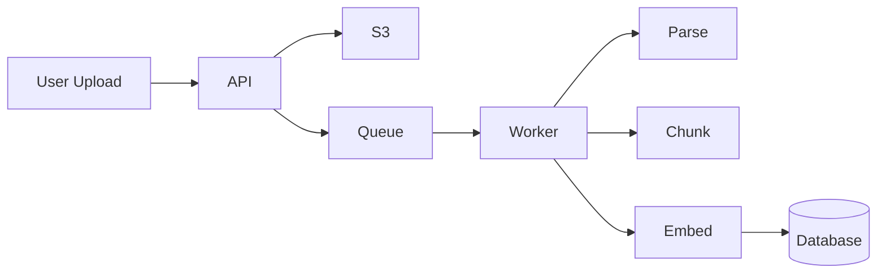
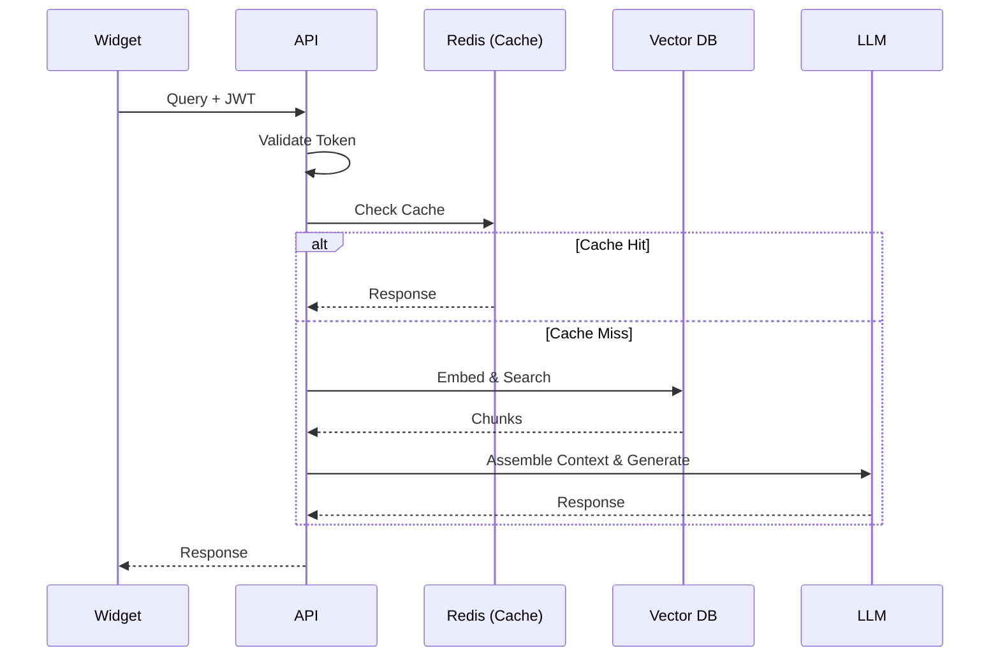

# Architecture

High-level architecture of the RAG Chatbot Platform.

## System Overview

```mermaid
graph TD
    User((User))
    Internet[Internet]
    LB[Load Balancer / Nginx]
    
    subgraph Client[Client Layer]
        Dashboard[Dashboard (Next.js)]
        Widget[Widget (Iframe)]
        APIClient[API Clients]
    end
    
    subgraph Backend[Backend Services]
        API[API Server (FastAPI)]
        Workers[Background Workers (Dramatiq)]
    end
    
    subgraph Data[Data Layer]
        db[(PostgreSQL + pgvector)]
        Redis[(Redis Cache/Queue)]
        S3[(S3 Storage)]
    end
    
    User --> Internet
    Internet --> LB
    
    LB --> Dashboard
    LB --> Widget
    LB --> API
    
    Dashboard --> API
    Widget --> API
    APIClient --> API
    
    API --> db
    API --> Redis
    API --> S3
    
    Workers --> db
    Workers --> Redis
    Workers --> S3
    
    Redis -.-> Workers
```

## Components

### API Server (FastAPI)

- **Authentication** - JWT and API key validation
- **Chat API** - Real-time chat with RAG
- **Project Management** - CRUD operations
- **Source Management** - Document ingestion
- **Rate Limiting** - Per-key/token limits
- **Caching** - Redis for hot data

### Background Workers

- **Document Parsing** - PDF, URL, text extraction
- **Chunking** - Semantic text splitting
- **Embedding Generation** - Vector creation
- **Queue Management** - Dramatiq with Redis

### Database (PostgreSQL + pgvector)

- **Projects** - Tenant data
- **Sources** - Document metadata
- **Chunks** - Text segments with embeddings
- **Conversations** - Chat history
- **Cache** - Cold storage for embeddings

### Cache (Redis)

- **Session Cache** - Hot token data
- **Rate Limit** - Sliding window counters
- **Queue** - Background job queue
- **Hot Embeddings** - Frequently accessed

### Storage (S3)

- **Uploaded Files** - Original documents
- **Public Files** - Widget assets

## Data Flow

### 1. Document Ingestion



1. User uploads file via API
2. File stored in S3
3. Job queued to background worker
4. Worker parses document
5. Worker chunks text semantically
6. Worker generates embeddings
7. Chunks + embeddings stored in DB

### 2. Chat Request



1. Widget sends query with JWT
2. API validates token + origin
3. Generate query embedding
4. Search vector DB for similar chunks
5. Assemble context + call LLM
6. Return response with citations

## Scaling Considerations

### Horizontal Scaling

- **API Servers** - Stateless, add more behind load balancer
- **Workers** - Add more for parallel processing
- **Redis** - Cluster mode for high throughput
- **PostgreSQL** - Read replicas for queries

### Vertical Scaling

- **pgvector** - Increase `shared_buffers`
- **Redis** - Increase `maxmemory`
- **Workers** - More CPU for PDF parsing

## Technology Stack

| Component | Technology |
|-----------|------------|
| API | FastAPI |
| Workers | Dramatiq |
| Database | PostgreSQL + pgvector |
| Cache/Queue | Redis |
| Storage | S3 (Cloudflare R2) |
| LLM | Azure OpenAI |
| Frontend | Next.js |
| Auth | JWT |
