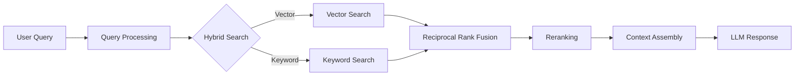

# Retrieval Pipeline

How the RAG system finds relevant content for chat queries.

## Pipeline Overview



## 1. Query Processing

### Input Cleaning

- Remove extra whitespace
- Normalize unicode
- Handle special characters

### Key Term Extraction

Extract important terms for keyword search:

```python
# Remove stopwords, get important terms
terms = ["return", "policy", "30", "days"]
```

### Query Expansion

Generate query variations for better recall:

- Original: "return policy"
- Expansion: "return policy in detail"
- Expansion: "Explain return policy"
- Expansion: "Information about return policy"

## 2. Embedding Generation

### Model

- **Provider**: Azure OpenAI
- **Model**: `text-embedding-3-small`
- **Dimensions**: 1536

### Caching Strategy

```mermaid
flowchart LR
    Redis[Redis (Hot)] -->|1 hour| DB[PostgreSQL (Cold)]
    DB -->|30 days| API
```

Cache embeddings to reduce API calls and latency.

## 3. Hybrid Search

### Vector Search (pgvector)

Semantic similarity search using HNSW index:

```sql
SELECT id, text, 1 - (embedding <=> :query_embedding) as score
FROM chunks
WHERE project_id = :project_id
ORDER BY embedding <=> :query_embedding
LIMIT 50;
```

### Keyword Search (Postgres TSVECTOR)

Full-text search using PostgreSQL:

```sql
SELECT id, text, ts_rank(tsv, query) as score
FROM chunks, to_tsquery('english', 'return & policy')
WHERE project_id = :project_id
ORDER BY score DESC
LIMIT 50;
```

### Why Hybrid?

| Search Type | Strength | Weakness |
|-------------|----------|----------|
| Vector | Semantic similarity | May miss exact terms |
| Keyword | Exact matches | No semantic understanding |

Hybrid combines both for better results.

## 4. Score Fusion

### Reciprocal Rank Fusion (RRF)

Combine rankings from vector + keyword search:

```python
def rrf_score(rank, k=60):
    return 1 / (k + rank)

# Score = vector_rrf + keyword_rrf
```

### Adaptive Weights

Adjust weights based on query:

- **Long queries**: More keyword weight
- **Factual queries**: More vector weight
- **Conversational**: More vector weight

## 5. Reranking

### Cross-Encoder Reranking

Use a cross-encoder to re-score top candidates:

- **Model**: `BAAI/bge-reranker-base`
- **Input**: Query + Candidate text
- **Output**: Relevance score

### Final Score

```
final_score = 0.7 * rrf_score + 0.3 * reranker_score
```

## 6. Context Assembly

### Token Budget

Allocate tokens intelligently:

| Component | Budget |
|-----------|--------|
| System prompt | 1000 |
| History | 8000 |
| Context | ~110000 |
| Response | 4000 |

### Chunk Selection

1. Sort by reranked score
2. Add chunks until token budget used
3. Trim final chunk if needed

### Citation Generation

For each chunk, generate citation:

```json
{
  "id": 1,
  "source_id": "src_123",
  "title": "FAQ Document",
  "page": 3,
  "section": "Returns",
  "text": "..."
}
```

## Performance Targets

| Metric | Target | Alert |
|--------|--------|-------|
| Total Latency | < 500ms | > 1000ms |
| Vector Search | < 100ms | > 200ms |
| Keyword Search | < 50ms | > 100ms |
| Reranking | < 150ms | > 300ms |
| Cache Hit Rate | > 70% | < 50% |

## Configuration

### Project-Level Settings

```json
{
  "retrieval": {
    "strategy": "hybrid",
    "vector_weight": 1.0,
    "keyword_weight": 1.0,
    "enable_reranking": true,
    "max_chunks_to_rerank": 50,
    "max_final_chunks": 10
  },
  "chunking": {
    "chunk_size": 384,
    "chunk_overlap": 58,
    "strategy": "semantic_first"
  }
}
```

### Tuning for Precision

```json
{
  "chunk_size": 256,
  "rrf_k": 30,
  "min_relevance_score": 0.3,
  "max_final_chunks": 5
}
```

### Tuning for Recall

```json
{
  "chunk_size": 512,
  "rrf_k": 100,
  "enable_query_expansion": true,
  "max_final_chunks": 20
}
```

## Monitoring

Track key metrics:

```sql
SELECT 
  AVG(retrieval_time_ms) as avg_latency,
  AVG(chunks_returned) as avg_chunks,
  AVG(cache_hit_rate) as cache_hit
FROM retrieval_metrics
WHERE project_id = :id
  AND created_at > NOW() - INTERVAL '7 days';
```
